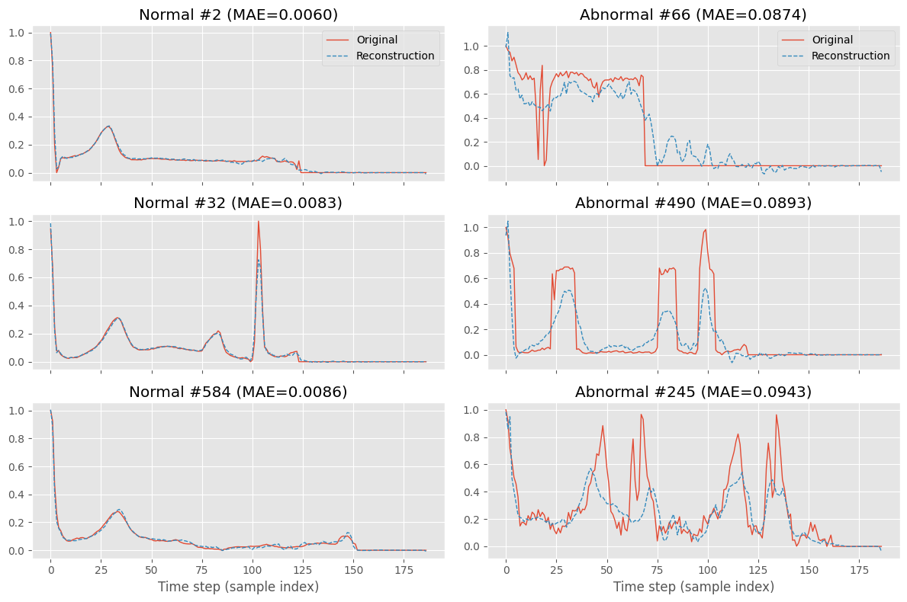

# ECG-Detector: ECG Anomaly Detection


## 📖 Project Overview

**ECG-Detector** is a deep learning-based system designed to detect anomalies in Electrocardiogram (ECG) signals. This project utilizes a **Convolutional Autoencoder (CNN-AE)** to reconstruct heartbeat data and distinguishes between normal and abnormal heartbeats based on the **Reconstruction Error**.

This approach falls under unsupervised (or semi-supervised) learning. The model is trained exclusively on "Normal" heartbeats, allowing it to identify anomalies by their inability to be accurately reconstructed.

### ✨ Key Features
* **Data Preprocessing**: Standardization and windowing of ECG signals.
* **CNN Autoencoder**: Uses 1D Convolutional layers (Conv1D) to extract temporal features for compression and reconstruction.
* **Anomaly Detection**: Implements dynamic thresholding based on Mean Absolute Error (MAE) loss.
* **Visualization**: Provides comparative plots (Original vs. Reconstructed), loss distribution histograms, and ROC curves.

---

## 🏗️ Architecture

The model follows an **Encoder-Decoder** architecture:

1.  **Encoder**: Compresses high-dimensional ECG time-series signals into a lower-dimensional **Latent Vector**, capturing the core features of a healthy heartbeat.
2.  **Decoder**: Attempts to reconstruct the original input signal from the latent vector.
3.  **Detection Logic**:
    * The model is trained only on **normal** data, resulting in low reconstruction error for healthy heartbeats.
    * When the model encounters an **anomaly** (which it has never seen), it fails to reconstruct it effectively, resulting in a high error.
    * **Flag**: If `Reconstruction Loss > Threshold`, the sample is classified as an anomaly.

---

## 📂 File Structure

```text
ECG-Detector/
│
├── cnn_autoencoder_baseline_withaug.ipynb         # Baseline Training (With Data Augmentation)
├── cnn_autoencoder_baseline_withoutaug.ipynb      # Baseline Training (No Data Augmentation)
├── cnn_autoencoder_infer.ipynb                    # Inference Pipeline: Load model & Predict & Visualization
│
├── cnn_autoencoder_batch_exp.ipynb                # Exp: Batch Size Analysis
├── cnn_autoencoder_channel_kernel_exp.ipynb       # Exp: Kernel Size & number of Channels Analysis
├── cnn_autoencoder_hyperparams_.ipynb             # Exp: Hyperparameter Tuning
├── cnn_autoencoder_latent_exp.ipynb               # Exp: Latent Dimension Analysis
├── cnn_autoencoder_lr_exp.ipynb                   # Exp: Learning Rate Sensitivity Analysis
├── cnn_autoencoder_optimizer_exp.ipynb            # Exp: Optimizer Comparison Analysis
│
└── README.md                                      # Documentation
```

---

## 🚀 Quick Start

Dataset Setup： https://www.kaggle.com/datasets/shayanfazeli/heartbeat

Baseline: cnn_autoencoder_baseline_withaug.ipynb

Execute the cells sequentially to Load Data -> Train Model -> Determine Threshold -> Evaluate Results.

---

## 📊 Results

#### 1. Signal Reconstruction

Normal Heartbeat: The reconstructed signal (Red) closely follows the original input (Blue).

Anomaly: The model fails to capture the shape of the abnormal heartbeat, leading to a visible gap (high error).



#### 2. Loss Distribution & Thresholding
A threshold is determined by analyzing the MAE distribution of the training set (e.g., Mean + 2*STD).
- Accuracy/Precision/Recall: See the notebook output for the classification report.
